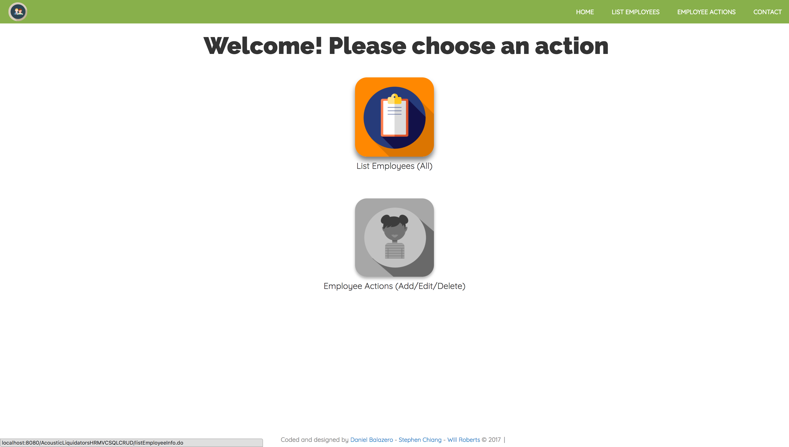
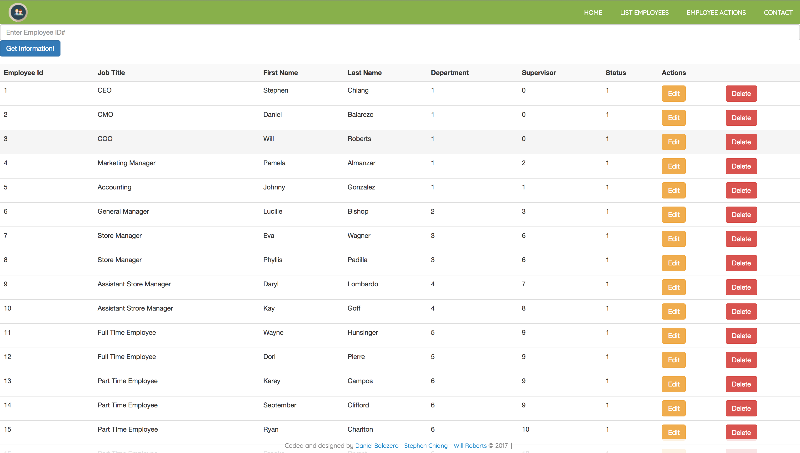
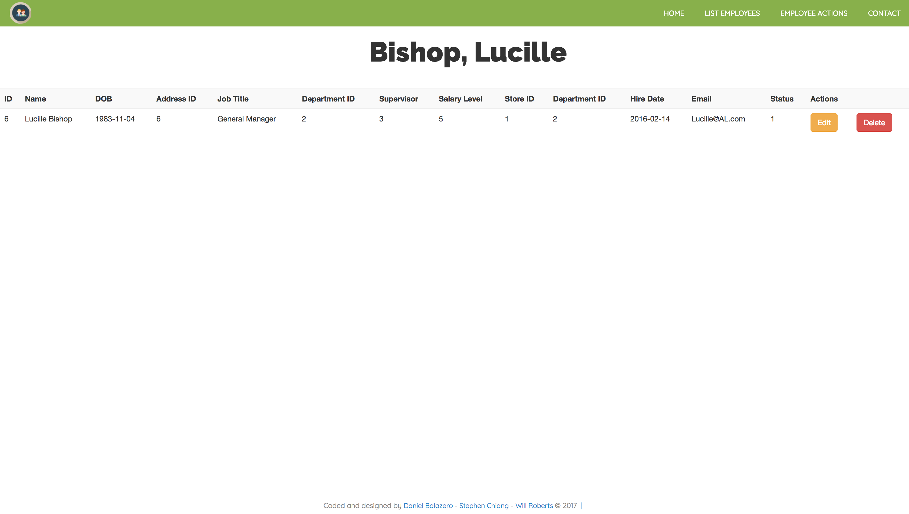
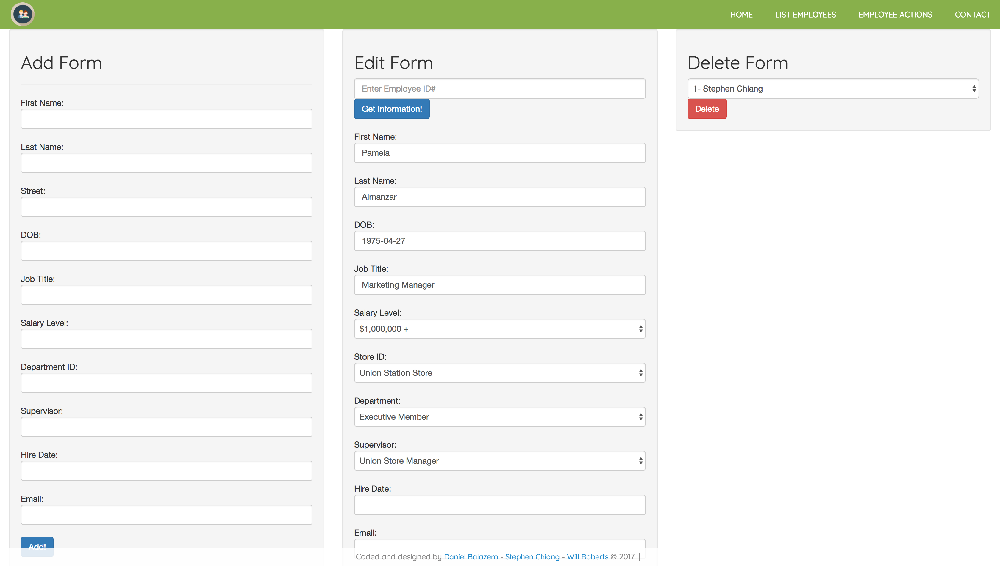
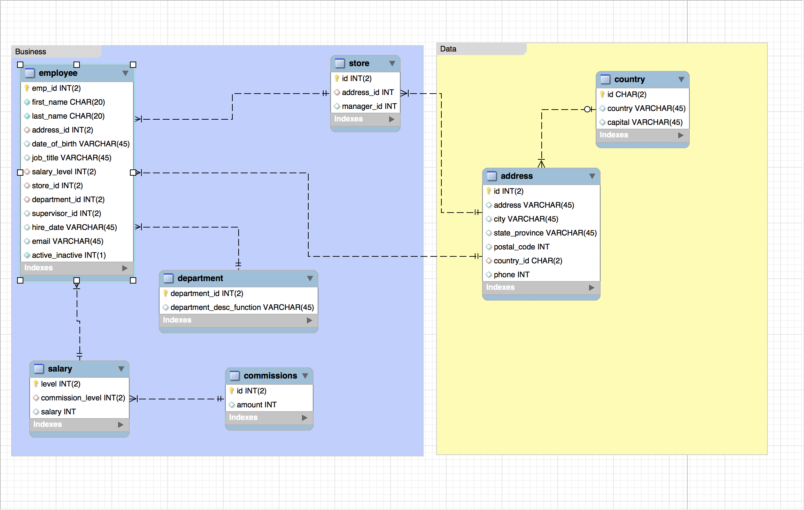
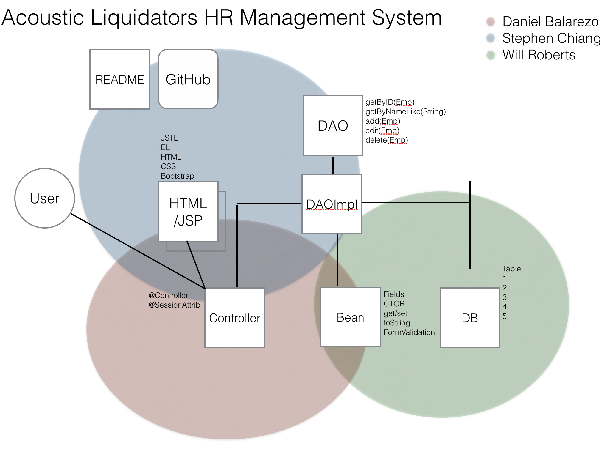

# Summary

An employee management web-app for Human Resources department using a MAMP stack consisting of Java, the Spring MVC framework, and MySQL database technologies with CRUD functionality. This web-app implements session control, and has a MySQL database deployed to an Apache Tomcat 8 Server. This is also the first time where we are attempted to implement Object-Relational Mapping (ORM) by passing the command object rather than individual database column values for operations between the .jsp-controller-DAO. However, we did have to pass just the id for two methods. The web-app is also mobile responsive and data can be viewed/manipulated with most popular mobile devices. The database was created with MySQL Workbench.

This web-app is a collaborative project. The goal, milestone, and separation of roles/responsibilities are illustrated in the structure/flow chart image embedded in the README but can also be found in slideshow format in the root folder. (Acoustic Liquidators is a randomly selected team name which does not have any influence on the project itself.) For the project's purpose, we created the functionality of deleting an employee, however, we also included an active/inactive data column that would be used to filter employees still with company.

Issues the team ran into:
    Commit conflicts stalled the project at times despite adherence to document control. This was our first time creating a sql database and deploying it to a server, so the initial set up with child rows and naming conventions had to be traced and optimized. The team intended to implement form validation, but time did not permit this time.

If more time were available:
    Potential features would be a calendar integration with reminders or monitors of HR actions on an employee. Perhaps a direct messaging feature or email integration would also be value added to the app's functionality. Additional search and sort methods would also be value added.

<p align="center">

</p>
<p align="center">

</p>
<p align="center"></p>


## In This Document
1. [How to Execute](#how-to-execute)
2. [Class Structure Overview](#class-structure-overview)

## How to Execute
- The web-app is hosted on my AWS server: <a href="http://www.chiangs.ninja:8080/AcousticLiquidatorsHRMVCSQLCRUD/">**here**</a>
- Download the entire program as a .war file <a href="AcousticLiquidatorsHRMVCSQLCRUD.war">**here**</a>

## Instructions
1. User arrives on landing page
2. User menu:
    - View All Employees
    - Employee Actions (Add/Edit/Delete)
3. Each employee manipulation option can also be executed directly from the inventory overview.

## Class Structure Overview
- The **alController** class is the controller and interacts with the **HRDAOImpl** class which implements methods declared in the **HRDAO** interface. The product and list objects are constructed using information from the **Employee** and **Address** class and accompanying database.
- The **alController** provides information back through **.jsp** files for the user to view and manipulate.

<p align="center">

</p>

## Code Examples
```
public Employee updateEmployee(Employee emp) {

		String firstName = emp.getFirstName();
		String lastName = emp.getLastName();
		Address address = emp.getAddress();
		String dob = emp.getDob();
		String jobTitle = emp.getJobTitle();
		int salaryLevel = emp.getSalaryLevel();
		int storeID = emp.getStoreID();
		int departmentID = emp.getDepartmentID();
		int supervisor = emp.getSupervisor();
		String hireDate = emp.getHireDate();
		String email = emp.getEmail();
		int status = emp.getStatus();
		Integer id = emp.getEmployeeID();

        String sql = "UPDATE employee SET first_name =?, "
        		+ "last_name = ?, address_id = ?, date_of_birth = ?"
        		+ ", job_title = ?, salary_level = ?, store_id = ?"
        		+ ", department_id = ?, supervisor_id = ?, hire_date = ?"
        		+ ", email = ?, active_inactive = ? WHERE emp_id = ?";

        try {
            Connection conn = DriverManager.getConnection(url, user, pass);
            PreparedStatement stmt = conn.prepareStatement(sql);

            stmt.setString(1, firstName);
			stmt.setString(2, lastName);
			stmt.setInt(3, address.getId());
			stmt.setString(4, dob);
			stmt.setString(5, jobTitle);
			stmt.setInt(6, salaryLevel);
			stmt.setInt(7, storeID);
			stmt.setInt(8, departmentID);
			stmt.setInt(9, supervisor);
			stmt.setString(10, hireDate);
			stmt.setString(11, email);
			stmt.setInt(12, status);
			stmt.setInt(13, id);

            int uc = stmt.executeUpdate();

            stmt.close();
            conn.close();

        } catch (Exception e) {
            e.printStackTrace();
        }
        return emp;
    }
```

## Technologies Used

- Java
- Spring MVC and Spring STS
- Gradle Managed Dependencies
- MySQL and MySQL Workbench
- Java Server Pages and JSTL/EL
- HTML
- CSS and Bootstrap
- JavaScript / JQuery
